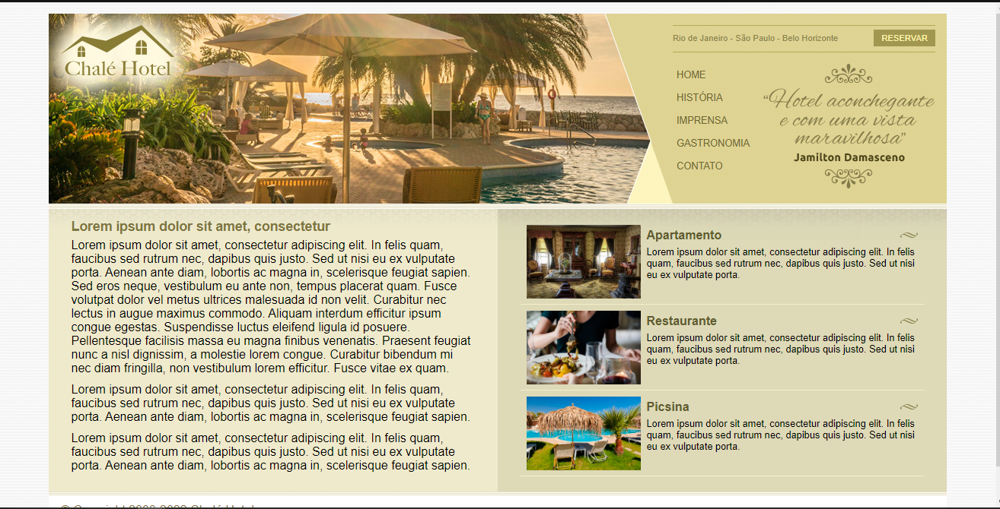

<h1 align="center"> Chalé Hotel </h1>

Aplicação web de uma pagina de hotel ficitcio usado pra testar conceitos de HTML e CSS.  

  <a href="#-tecnologias">Tecnologias</a>&nbsp;&nbsp;&nbsp;|&nbsp;&nbsp;&nbsp;
  <a href="#-projeto">Projeto</a>&nbsp;&nbsp;&nbsp;|

  

 

  

## 🚀 Tecnologias

Esse projeto foi desenvolvido com as seguintes tecnologias:

- HTML e CSS
- Git e Github

## 💻 Projeto

Chalé Hotel é uma página criada com o inttuito de praticar os conceitos básicos de HTML e CSS .

- [Visite o projeto online](https://danrodriguezdev.github.io/Chale-Hotel/)